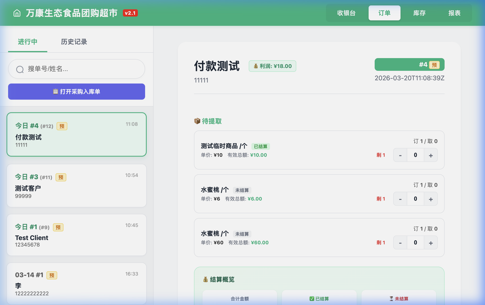
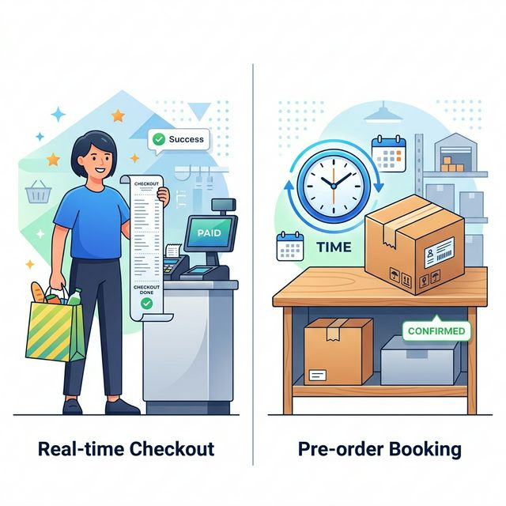
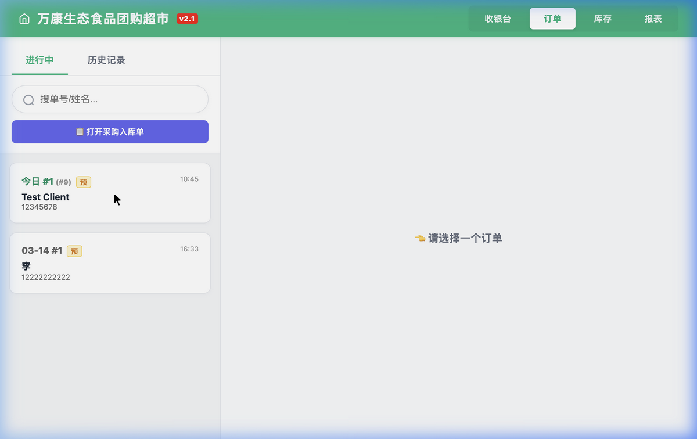

# 极简智能收银台 (Modern POS Demo)

[](docs/images/IMG_1227.png)

一款基于 **Go (后端)** + **SQLite3 (数据库)** + **原生 HTML/JS/CSS (前端)** 构建的轻量级、无依赖现代收银系统。
专为小微零售、特产店、果蔬生鲜等实体门店量身打造，支持 **称重商品（支持小数数量）**、**无码临时商品挂单**、**预付款实时追踪**、以及强大的 **预订单随时修改和反向装载** 功能！



---

## 🌟 核心运行逻辑与业务场景


为了帮助开发者和使用者更好地理解这套系统，以下是本系统处理日常门店业务的几大核心逻辑：

### 1. 实时收款与挂单预订 (Checkout vs Booking)
*   **实时结算收款**：客户拿着商品结账，收银员扫码或点击商品，确认金额后点击“结算收款”。系统会立刻从库存中**扣减对应数量**，生成一条**已完成(Completed)**状态的订单。
*   **挂单预订（Pending模式）**：对于需要备货、需要发快递、或者客户仅支付定金的场景，可以使用“挂单预订”。点击后将生成带有黄色 **“预”** 字标识的未完成订单。此时**库存已经被锁定（扣除）**，等待客户分批提货。



### 2. 强大的“临时商品”机制与自动价格同步
*   **痛点**：有时候生鲜或者某些新到货的特产品还没来得及入库定价，但客户急着要订购。
*   **解决**：收银员可以在收银台直接添加“临时商品”（价格默认为 0）。将该订单挂为“预订单”后，等店长在后方（采购入库模块）将该临时商品正式入库并**设置售价**后，系统会**自动、瞬间**同步所有包含该临时商品的未结账预订单！无需手动挨个修改，保证账单总额的绝对准确。


### 3. 多维度预付款追踪 (Pre-payment Tracking)
系统对预订单引入了颗粒度到**每一件商品**的付款状态追踪。
收银员在挂单或后续修改时，可以对部分商品勾选“已结算”。订单详情内部会实时展现一份 **💰 结算概览**，清晰分别列出：
*   **合计金额**
*   **✅ 已结算** (针对已付款的商品)
*   **⏳ 未结算** (剩余尾款)
*   *注：当客户在提货时，如果提走了某个商品，系统后端会自动将该商品的付款属性标记为“已结算”，防止出现“货被拿走但钱没付”的漏洞。*

### 4. 预订单“随时修改” (Edit Existing Orders)
系统提供极其灵活的防呆编改能力。
*   **拉回收银台**：在订单详情页点击 **“✏️ 修改预订”** 按钮，系统会将该订单的原有商品列表、原先选择的结算状态、原客户姓名电话，**完整反向装载回收银台**。
*   **安全库存校验**：修改时，增加商品数量会进一步扣减库存，减少数量则会释放库存。如果某件商品之前已经被客户提取过，后端将**绝不会允许**收银员将订购数量修改得低于已提货数量，从而确保账实相符。


---

## 💻 技术栈 (Tech Stack)

该项目秉持 **“极简主义”** 和 **“零心智负担”**：
1.  **Backend (后端)**: `Go 1.21+`。使用标准库 `net/http` 提供纯 RESTful API 接口，完全剥离沉重的 Web 框架。
2.  **Database (数据库)**: `SQLite3` (采用 `modernc.org/sqlite` 纯 Go 驱动，免去 CGO 编译的烦恼，各个平台无缝跨编)。
3.  **Frontend (前端)**: 仅需一个经过模块化排版的 `index.html`，无需 Node.js、Webpack、Vite 或 npm。零构建过程，修改直接见效！
    *   **Vanilla JS**: 高效纯粹的 DOM 操作。
    *   **Native CSS**: CSS Variables 实现主题及亮暗自适应（预留），原生的 Glassmorphism 毛玻璃特效。

---

## 🚀 如何运行与部署 (How to Run)

仅需两步即可在任何机器上启动本系统：

### 1. 前置要求
*   安装最新版 `Go` 环境 (https://golang.org/dl/)

### 2. 编译与运行
克隆本仓库到本地，并在终端中进入项目目录，执行：

```bash
# 获取依赖 (主要是 modernc sqlite 驱动)
go mod tidy

# 编译为可执行文件
go build -o pos-demo main.go

# 运行它！
./pos-demo
```

启动后，在浏览器中打开 `http://localhost:8080` 即可开始使用！
> 系统会自动在当前运行目录下创建一个 `data/` 文件夹用于存储 SQLite 本地数据库文件(`pos.db`)。如果你想备份数据，直接复制该 `.db` 文件即可。

---

## 📸 界面预览 (Screenshots)

### 预订单管理与标记

*(所有预定单根据天数重置共用编号，并附带醒目的黄色标识)*

### 订单利润与自动结算概览

*(随时追踪订单的退款、分批提货状态，并核算实时利润)*

---

## 📜 许可与致谢 (License & Credits)

本开源项目遵循 MIT License。您可以自由地在商业或非商业环境中部署、修改、或者二次分发本系统！

在使用、借鉴或基于本项目进行二次开发时，**请在项目原作者或致谢名单中标注：[Ju1ian SyntaxErr0r Zhang]**。
感谢SyntaxErr0r的创意、功能需求推动以及全流程测试保障！如果这个项目帮助到了您，也欢迎为项目点选一个 Star 🌟！
